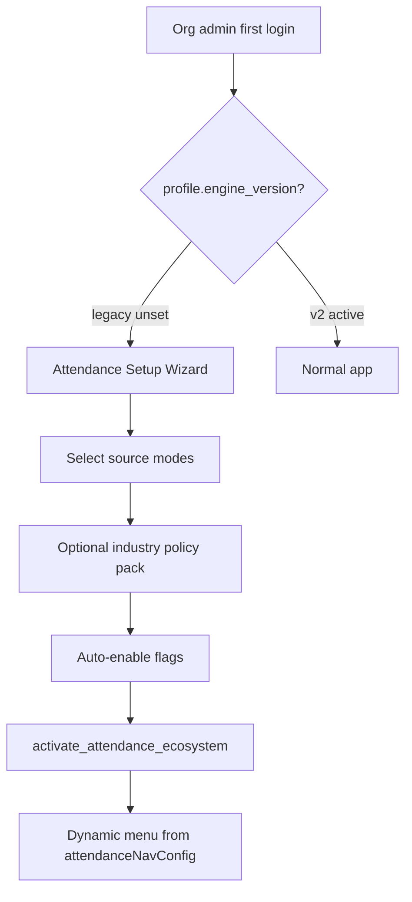

# Enterprise Attendance & Workforce — Gap Analysis Report

**Project:** `etax_payroll`  
**Analysis date:** 2026-05-20  
**Method:** Code scan (backend + frontend), not generic HRMS theory  
**Rules:** Legacy attendance preserved; extensions only; payroll-safe scalar pipeline unchanged.

---

## Executive summary

Your system already has a **strong payroll-safe architecture**:

```
Raw Events (optional) → Policy Orchestrator → attendances (legacy table)
                              ↓
              payroll_attendance_calculator → PAYABLE_DAYS / WAGE_PRORATION_FACTOR / LOP_UNITS
                              ↓
                    salary_engine_v2 (formula) → payroll components
```

**Do not modify:** `attendances` contract for payroll gather, `/api/attendance/*` routes, `payroll_attendance_calculator.py` scalar outputs, salary formula variable names.

**Extension surface:** `/api/wf/*`, `/api/wf/enterprise/*`, `wf_*` tables/services, additive columns on `attendances`, feature flags, `organisation_attendance_profile`.

**Overall maturity:** Legacy HR attendance **production-ready**; enterprise WF layer **foundation built (~60%)**, several sources and industry scenarios **plugin-level only**.

---

# 1. CURRENT SYSTEM REPORT

## A. Existing attendance architecture

| Layer | Path | Role |
|-------|------|------|
| Legacy domain | `backend/models/attendance_models.py` | `attendances`, `leaves`, `employee_leave_balances` |
| Legacy API | `backend/api/attendance_route.py` | `/api/attendance/*` |
| Legacy CRUD | `backend/crud/attendance_crud.py` | Create/update/bulk + pay-period lock + WF freeze guard |
| Calendar | `backend/services/attendance_calendar_service.py` | Bulk calendar marks |
| Leave | `backend/services/leave_service.py` | Leave approval |
| Payroll bridge | `backend/services/payroll_attendance_calculator.py` | **Single source of payroll scalars** |
| Payroll gather | `backend/services/payroll_run_gather.py` | Reads `attendances` for pay period |
| WF models | `backend/models/wf_models.py`, `wf_enterprise_models.py` | Extension tables |
| WF API | `backend/api/wf_routes.py`, `wf_enterprise_routes.py` | `/api/wf/*`, `/api/wf/enterprise/*` |
| WF services | `backend/services/wf_*.py` | Engine, roster, shift, policy, events, freeze, etc. |
| Frontend legacy | `frontend/src/Moduels/attendance/*` | Mark, table, API client |
| Frontend WF | `frontend/src/components/pages/Attendance/Wf*.jsx` | Hub, setup, roster, devices, etc. |
| Nav hub | `frontend/src/Moduels/attendance/attendanceNavConfig.js` | Grouped UX (2026 refactor) |

## B. Existing DB tables

### Legacy (payroll-critical)

| Table | Model file |
|-------|------------|
| `attendances` | `attendance_models.Attendance` |
| `leaves` | `attendance_models.Leave` |
| `employee_leave_balances` | `attendance_models.EmployeeLeaveBalance` |
| `organisation_holidays` | Used via `crud/wf_holiday_crud.py` / org models |
| `pay_periods.attendance_leave_locked` | `payroll_models.PayPeriod` |

### WF extension (migration `a1b2c3d4e5f6`, `b2c3d4e5f6a7`, `c8d9e0f1a2b4`)

| Table | Purpose |
|-------|---------|
| `organisation_attendance_profile` | Tenant engine version + enabled_modes |
| `organisation_source_config` | Per-source enable + settings |
| `feature_flags` / `organization_feature_flags` | Tenant flags |
| `raw_attendance_events` | Punch stream (separate from day result) |
| `wf_shift_templates`, `wf_shifts`, `wf_shift_segments` | Shift engine |
| `wf_shift_versions` | Temporal template inheritance |
| `wf_roster_plans`, `wf_roster_assignments`, `wf_roster_state_log` | Roster + SM |
| `wf_attendance_cycles`, `wf_weekly_off_rules` | Cycle config (schema exists) |
| `wf_attendance_policies`, `wf_policy_rules`, `wf_policy_versions` | Policy engine |
| `attendance_exceptions`, `attendance_exception_*` | Exceptions |
| `wf_recompute_jobs`, `wf_recompute_job_items` | Recompute |
| `attendance_snapshots`, `policy_snapshots` | Payroll audit |
| `wf_approval_*` | Approvals / ESS payloads |
| `attendance_devices`, `device_*_logs` | Device registry |
| `wf_freeze_records` | Freeze hierarchy |
| `wf_policy_execution_log` | Orchestrator trace |
| `wf_attendance_daily_projection` | Materialized analytics |
| `wf_dead_letter_events`, `wf_ops_metrics` | Observability |
| `label_master`, `organization_labels`, `terminology_pack` | Dynamic labels |

### Additive columns on `attendances` (do not remove)

`payable_fraction`, `policy_result_json`, `attendance_source`, `overtime_hours`, `late_minutes`, `early_exit_minutes`, `shift_id`, `roster_assignment_id`, `engine_version`, `approval_status`

## C. Existing attendance flow

```mermaid
flowchart LR
  subgraph inputs
    MANUAL["Manual HR /api/attendance"]
    BULK["Bulk / Excel"]
    CAL["Calendar job"]
    RAW["Raw ingest /api/wf/events"]
    ESS["ESS requests"]
  end
  subgraph day
    ORCH["wf_rule_orchestrator"]
    ATT["attendances row"]
  end
  subgraph payroll
    GATHER["payroll_run_gather"]
    CALC["payroll_attendance_calculator"]
    SALARY["salary_engine_v2"]
  end
  MANUAL --> ATT
  BULK --> ATT
  CAL --> ATT
  RAW --> ORCH --> ATT
  ESS --> ATT
  ATT --> GATHER --> CALC --> SALARY
```



## D. Existing payroll dependency

| Component | File | Notes |
|-----------|------|-------|
| Scalar computation | `services/payroll_attendance_calculator.py` | `AttendancePayrollScalars.to_formula_variables()` |
| Formula vars | `PAYABLE_DAYS`, `TOTAL_WORKING_DAYS`, `WAGE_PRORATION_FACTOR`, `LOP_UNITS`, `OVERTIME_UNITS`, `OVERTIME_HOURS` (in breakdown), unit buckets | **No `NIGHT_SHIFT_ALLOWANCE` scalar** |
| WPF | `wage_proration_factor = payable_days / total_working_days` (capped at 1) | Documented in calculator |
| Config | `organisations.hr_settings` JSONB → `merge_payroll_cfg()` | Week-offs, holidays, missing policy |
| Roster mode | `total_working_days_mode: roster_based` | **Declared but not implemented** — falls back to calendar-minus |
| Snapshot | `services/wf_snapshot_service.py` | On payroll process + payroll freeze event |
| Lock | `pay_periods.attendance_leave_locked` + `attendance_crud.assert_attendance_range_unlocked` | |

## E. Existing shift logic

| Capability | File | Status |
|------------|------|--------|
| Templates / shifts | `wf_models`, `wf_shift_engine.py` | Basic fixed times, cross-midnight |
| Segments / breaks | `wf_shift_segments`, `wf_shift_ops_service.py` | Paid/unpaid, standby/on-call |
| Overlap / fatigue | `wf_shift_engine.resolve_overlap`, `check_fatigue` | In-process |
| Match day | `match_shift_for_day` | Roster assignment → shift → template |
| Dynamic allocate | `POST /api/wf/enterprise/shifts/allocate` | Manual API |
| Auto roster generation | — | **Missing** |
| Excel roster import | — | **Missing** |
| Hospital 3/4 shift presets | Seed packs only | **Partial** |

## F. Existing attendance calculations

- **Day result:** `wf_day_result_service.recompute_employee_day` → orchestrator → writes `attendances.status`, `payable_fraction`, `overtime_hours`, `late_minutes`
- **Policy:** `wf_policy_engine.py` — grace, late_entry, early_exit, missing_punch, overtime, absent
- **Legacy status fractions:** `attendance_crud._day_fraction_for_status` (HD = 0.5)
- **Payroll units:** Aggregated from status rows in gather → `compute_payroll_attendance_scalars`

## G. Existing APIs

### Legacy `/api/attendance` (`attendance_route.py`)

- `GET/POST /` list/create
- `POST /bulk`
- `POST /jobs/apply-calendar`
- `GET/POST /leave/*`, approve
- `GET/PUT /{attendance_id}`

### Workforce `/api/wf` (`wf_routes.py` ~832 lines)

- Profile activate, labels, flags, holidays
- Raw events ingest/list
- Recompute jobs
- Shift templates, rosters, publish
- Policies + rules + publish
- Exceptions resolve
- Approvals, ESS (regularization, punch correction, dispute, mobile)
- Analytics dashboard

### Enterprise `/api/wf/enterprise` (`wf_enterprise_routes.py`)

- Devices, terminals, freeze
- Roster SM (submit/approve/freeze/archive)
- Shift inherit/segments/allocate
- Ops metrics, worker health, policy execution logs
- Projections refresh/summary
- ESS shift-swap, OT request

## H. Existing frontend pages

| Route | Component | Purpose |
|-------|-----------|---------|
| `/attendance` | `AttendanceHub.jsx` | Grouped navigation |
| `/attendance/mark` | `MarkAttendancePage.jsx` | Employee dropdown form |
| `/attendance/records` | `AttendanceTablePage.jsx` | List |
| `/attendance/calendar` | `DailyAttendance.jsx` | Calendar UI |
| `/attendance/bulk` | `AttendanceBulkUpload.jsx` | Excel bulk |
| `/attendance/apply-calendar` | `ApplyCalendar.jsx` | Pattern apply |
| `/attendance/leave` | `LeaveApproval.jsx` | Leave |
| `/attendance/holidays` | `HolidayManagement.jsx` | Holidays |
| `/attendance/summary` | `AttendancsSummary.jsx` | Pay period summary |
| `/attendance/setup` | `WfAttendanceSetup.jsx` | Mode + flag activation |
| `/attendance/*` WF | `WfDashboard`, `WfRosterBoard`, etc. | Enterprise features |

Legacy URLs redirect to new paths (`App.js`).

## I. Existing cron / background jobs

| Job | File | Queue |
|-----|------|-------|
| `wf.recompute_job` | `tasks/wf_attendance_tasks.py` | `attendance` (Celery) |
| Calendar apply | Sync API `POST /attendance/jobs/apply-calendar` | No cron — on-demand |
| Payroll | Payroll routes | Separate lifecycle |

**Missing:** Scheduled nightly recompute, device sync poller, projection refresh cron.

## J. Existing approval flow

- **Leave:** `leave_service.approve_or_reject_leave` + `LeaveApproval.jsx`
- **WF generic:** `WfApprovalRequest` + `WfApprovals.jsx` + decide endpoint
- **ESS:** Creates approval rows (regularization, punch correction, dispute, shift-swap, OT)
- **Roster:** State machine approvals (submit → approve → publish) in `wf_roster_state_machine.py`

## K. Existing attendance sources

Seeded in `wf_seed_service.py` (`ATTENDANCE_SOURCE_MODES`):

`biometric`, `mobile_checkin`, `manual_hr`, `shift_roster`, `geo_fence`, `qr`, `face_scan`, `excel_upload`, `default_present`, `api_push`, `browser_login`, `hybrid`, `contractor`, `client_site`, `calendar_auto`

**Activation:** `wf_profile_service.activate_attendance_ecosystem` + `OrganisationSourceConfig.enabled`

**Ingestion wired:** `manual_hr` (legacy), `excel_upload` (bulk), `calendar_auto` (job), `mobile` (ESS), `biometric` (device_id on raw event — no device SDK)

---

# 2. COMPATIBILITY CHECK (26 requirements)

| # | Requirement | Status | Risk | Reusable | Recommendation |
|---|-------------|--------|------|----------|----------------|
| 1 | Biometric | **Partial** | Med | `attendance_devices`, raw `device_id`, plugin | Device SDK adapter + ingest webhook; keep raw_events |
| 2 | Mobile check-in | **Partial** | Low | `POST /wf/ess/mobile-attendance`, geo fields on raw | Mobile app + geo validation flag |
| 3 | Manual HR entry | **Supported** | Low | `attendance_route`, `MarkAttendancePage` | Keep as default legacy path |
| 4 | Shift roster | **Partial** | Med | Roster SM, assignments, allocate API | Add roster Excel import + auto-gen phase 3 |
| 5 | Geo-fence | **Missing** (plugin only) | Med | `latitude`, `longitude`, `geo_radius` on raw | `wf_geo_validation_service` + org boundary JSON |
| 6 | QR attendance | **Missing** (plugin only) | Low | `qr_reference` column | QR token API + mobile scan page |
| 7 | Face scan | **Missing** (plugin only) | Med | `image_url`, `biometric_reference` | External FR provider integration |
| 8 | Excel upload | **Supported** | Low | `POST /attendance/bulk`, `AttendanceBulkUpload` | Map bulk → raw_events when v2 enabled |
| 9 | Default present mode | **Partial** | Low | Plugin + calendar job | Policy pack `it_flexible` + auto-mark rules |
| 10 | Dynamic attendance engine | **Partial** | Med | Profile, flags, orchestrator | Mandatory setup wizard on first org login |
| 11 | Industry policies | **Partial** | Med | `WfPolicyPack` seed, publish policies | One-click industry bootstrap from pack |
| 12 | Dynamic payroll proration | **Supported** | Low | `WAGE_PRORATION_FACTOR` | Expose in org HR settings UI |
| 13 | OT calculations | **Partial** | Med | Policy `overtime` → `overtime_hours` → `OVERTIME_UNITS` | OT multipliers as salary derived vars, not attendance status |
| 14 | Night shift allowance | **Missing** | Med | `night_shift` on template | New scalar `NIGHT_SHIFT_UNITS` → formula only |
| 15 | Rotational shifts | **Partial** | Med | Shift engine, segments | Rotation planner + cycle rules |
| 16 | Multi-shift hospitals | **Partial** | High | Segments, healthcare pack seed | Hospital shift templates (3/4 shift) + roster patterns |
| 17 | Week-off salary rules | **Partial** | Low | `count_weekoffs_as_payable`, `WEEK_OFF_UNITS` | Admin UI for work week + payable WO policy |
| 18 | Holiday salary rules | **Partial** | Low | `organisation_holidays`, `HOLIDAY_UNITS` | Link holiday calendar to policy engine |
| 19 | Late penalty rules | **Partial** | Med | `late_entry` rules, `late_minutes` | Escalation rules + LOP bridge (formula, not status→salary) |
| 20 | Attendance locking | **Partial** | Med | `is_locked`, pay period lock, `wf_freeze_records` | Unify UI + enforce on all write paths |
| 21 | Editable punches | **Partial** | Med | ESS punch correction approvals | HR punch editor on raw_events + audit |
| 22 | Attendance audit logs | **Partial** | Med | `wf_policy_execution_log`, `WfAuditLog`, payroll lifecycle audit | Punch version table + immutable audit chain |
| 23 | Dynamic attendance cycle | **Partial** | Med | `wf_attendance_cycles` table | Cycle API + link to pay_period alignment |
| 24 | Org-specific work week | **Partial** | Low | `hr_settings` week_off_weekdays | `wf_weekly_off_rules` + UI |
| 25 | Roster auto-generation | **Missing** | High | Roster assignments CRUD | Scheduling algorithm phase 4 |
| 26 | Payroll-ready summary | **Supported** | Low | `compute_payroll_attendance_scalars`, period summary route | Enhance UI; use projections for dashboard only |

---

# 3. SUPER ADMIN FIRST-TIME SETUP FLOW

## Current state

- **Exists:** `WfAttendanceSetup.jsx` + `POST /api/wf/attendance-profile/activate` + industry presets (IT, hospital, factory, retail, security)
- **Gap:** Not blocking first login; no guided wizard; flags default **off** (`wf_engine_v2` false)

## Target architecture



## DB (existing + extend)

| Table | Use |
|-------|-----|
| `organisation_attendance_profile` | `engine_version`, `enabled_modes`, `terminology_pack_code` |
| `organisation_source_config` | Per-mode `settings_json`, `validations_json` |
| `organization_feature_flags` | Module toggles |
| **Add:** `profile.setup_completed_at` | Optional column — skip wizard when set |

## API flow

1. `GET /api/wf/attendance-profile` — if `engine_version=legacy` and no modes → `requires_setup: true`
2. `GET /api/wf/sources` — checklist UI
3. `POST /api/wf/attendance-profile/activate` — existing
4. `POST /api/wf/onboarding/bootstrap` — existing partial in `wf_onboarding_service.py` — extend for policy pack

## Frontend

- New: `AttendanceSetupWizard.jsx` (3 steps) — call on dashboard redirect if `requires_setup`
- Reuse: `WfAttendanceSetup.jsx` logic
- **Do not remove** legacy pages — hide WF routes until `wf_engine_v2` enabled

## Middleware

- Optional: `wf_setup_gate` dependency on WF routes only — legacy `/api/attendance` always works

---

# 4. ATTENDANCE CYCLE ENGINE

| Scenario | Schema | Engine | Gap |
|----------|--------|--------|-----|
| Hospital 3/4 shifts | `wf_shift_templates`, `wf_shift_segments` | `wf_shift_engine` | No hospital preset UI, no rotation |
| Industry 5-day week | `wf_weekly_off_rules`, `hr_settings` | Payroll calculator | Rules not fully driving day result |
| 5.5 day (alt Saturday) | — | — | **Missing** — needs `wf_attendance_cycles.config_json` + rule type `alternate_saturday` |
| 6-day week | `wf_weekly_off_rules` | Partial | Admin UI |

**Rule engine:** Extend `wf_policy_engine` + orchestrator holiday stage — link `organisation_holidays` and weekly off rules before finalize.

**Safe extension:** New rule types in `wf_policy_rules` only; never write salary from policy engine.

---

# 5. PAYROLL + ATTENDANCE RULES

| Scalar | Supported | File |
|--------|-----------|------|
| `PAYABLE_DAYS` | Yes | `payroll_attendance_calculator.py` |
| `LOP_UNITS` | Yes | Same |
| `WAGE_PRORATION_FACTOR` | Yes | Same |
| `OVERTIME_UNITS` / hours | Partial (units from bucket) | Policy sets `overtime_hours` on row |
| `NIGHT_SHIFT_ALLOWANCE` | **No** | Add as derived variable in salary engine, fed by policy metadata |
| `WEEK_OFF_PAY` | Partial (`WEEK_OFF_UNITS`, payable config) | Not separate allowance component |
| `HOLIDAY_PAY` | Partial (`HOLIDAY_UNITS`) | Same |

**OT multipliers / Sunday OT / holiday OT:** Implement in `salary_engine_v2` derived variables reading `attendances.overtime_hours` + policy JSON — **not** by changing attendance status.

---

# 6. SHIFT + ROSTER ENGINE

| Feature | Status |
|---------|--------|
| Shift timings | Yes — template + shift rows |
| Shift size / count | Partial — `capacity` on template |
| Rotating shifts | Partial — fatigue only |
| Auto roster generation | **Missing** |
| Excel roster upload | **Missing** |
| OT / night tagging | Partial — segments `is_on_call`, template `night_shift` |
| Roster freeze/publish/archive | **Yes** — `wf_roster_state_machine.py` |

---

# 7. ATTENDANCE EDITING + LOCKING

| Feature | Status |
|---------|--------|
| Punch editing | ESS approval only |
| Approval workflow | `WfApprovalRequest` |
| Attendance lock | `is_locked` + WF freeze attendance |
| Payroll lock | `pay_periods.attendance_leave_locked` + `FREEZE_PAYROLL` on process |
| Audit trail | Partial — not per-field punch history |
| Version tracking | `wf_shift_versions`, policy versions — not attendance row versions |

---

# 8. LATE ATTENDANCE RULE ENGINE

**Supported in** `wf_policy_engine.py`: `grace_time`, `late_entry` (strikes → half day), `early_exit`, `missing_punch`.

**Gaps:** Salary deduction escalation, LOP auto-bridge from late count, configurable per department.

**Extend:** New rule types `late_strike_accumulator`, `late_lop_bridge` writing **flags only**; payroll reads flags via optional `policy_result_json` in gather (future).

---

# 9. FUTURE SCALE

Architecture supports via:

- `WfAttendanceSourcePlugin.handler_class` — plugin registry
- `wf_event_bus` + DLQ — async integrations
- `raw_attendance_events` — any device/channel
- Feature flags — gradual rollout
- Projections — analytics offload

**Not yet:** Multi-timezone normalization, multi-country statutory, AI anomaly (flags exist), WhatsApp channel.

---

# 10. FINAL DELIVERABLES

## 1. GAP ANALYSIS

See sections 2 and compatibility table above.

## 2. RISK REPORT

| Risk | Severity | Mitigation |
|------|----------|------------|
| Breaking payroll if `attendances` schema/API changed | Critical | Additive columns only; gather unchanged |
| Dual write legacy + raw events drift | High | Flag `wf_dual_write`; recompute job |
| Policy engine changes status → payroll surprise | High | Keep scalars as payroll contract; document status mapping |
| `roster_based` working days not implemented | Medium | Don't enable in UI until implemented |
| Too many WF flags off by default | Low | Setup wizard auto-enables selected modules |
| Device ingest without validation | Medium | Geo/QR validation services behind flags |

## 3. BACKWARD COMPATIBILITY REPORT

| Asset | Action |
|-------|--------|
| `attendances` table | **Never rename/drop** |
| `/api/attendance/*` | **Never remove** |
| `AttendancePage` / bulk / calendar | Keep; routed via hub |
| `payroll_attendance_calculator` | **Never bypass** for net pay |
| Orgs on `engine_version=legacy` | Default; v2 opt-in |
| Old frontend URLs | Redirects in `App.js` |

## 4. DATABASE CHANGES REQUIRED (future phases)

| Phase | Migration | Content |
|-------|-----------|---------|
| Done | `a1b2c3d4e5f6`, `b2c3d4e5f6a7`, `c8d9e0f1a2b4` | WF + enterprise |
| P1 | `d1e2f3a4b5c6_setup_completed.py` | `organisation_attendance_profile.setup_completed_at` |
| P2 | `punch_versions` | Optional `raw_attendance_event_versions` |
| P3 | `roster_import_batches` | Excel roster staging |
| P4 | `wf_attendance_cycle_rules` | 5.5 day, alt Saturday JSON rules |

## 5. SAFE MIGRATION PLAN

1. `alembic upgrade head` on staging
2. `py scripts/seed_wf_platform.py`
3. Per org: activate v2 on pilot only
4. Enable `wf_dual_write` → verify recompute
5. Enable `wf_raw_events` for punch sources
6. Payroll regression: `tests/test_payroll_attendance_*`, `test_wf_*`
7. Production: flags per org, not global

## 6. FEATURE FLAG STRATEGY

| Flag | Default | When enable |
|------|---------|-------------|
| `wf_engine_v2` | false | After setup wizard |
| `wf_raw_events` | false | Biometric/mobile/QR |
| `wf_policy_engine` | false | After policies published |
| `wf_roster` | false | Shift orgs |
| `wf_ess` | false | Employee portal |
| `wf_dual_write` | false | Migration period |
| `wf_recompute_async` | false | High volume |

**Rule:** Legacy payroll path works with **all flags off**.

## 7. TENANT CONFIGURATION DESIGN

```
organisation_attendance_profile (engine_version, enabled_modes, default_source)
    → organisation_source_config (per mode settings/validations)
    → organization_feature_flags
    → organisations.hr_settings.payroll (proration, week-offs)
    → wf_attendance_cycles + wf_weekly_off_rules
    → wf_attendance_policies (published rules)
```

## 8. ENTERPRISE ARCHITECTURE (target)

```
Sources (plugins) → Raw Events → Orchestrator → Day Result (attendances)
                                                      ↓
                                            Exceptions / Approvals
                                                      ↓
                                    Payroll Gather → Scalars → Formula Engine
```

## 9. API DESIGN (namespaces)

- **Legacy:** `/api/attendance` — unchanged
- **WF:** `/api/wf` — product features
- **Enterprise:** `/api/wf/enterprise` — ops, devices, SM, projections
- **Future:** `/api/wf/v2/devices/webhook` — device partners

## 10. FRONTEND SCREEN LIST

| Screen | Status |
|--------|--------|
| Attendance Hub | Done |
| Mark / Records / Calendar / Bulk | Done |
| Setup wizard (first-run) | **To build** |
| Roster board | Done (basic) |
| Policies | Done (basic) |
| Employee ESS portal | Partial (API only) |
| Device admin | Done |
| Geo map / QR mobile | **Missing** |

## 11. POLICY ENGINE DESIGN

Pipeline in `wf_rule_orchestrator.py`:

`validation → shift_match → grace → late → overtime → holiday → compliance → finalize`

Extend holiday stage to read `organisation_holidays` + `wf_weekly_off_rules`. Store trace in `wf_policy_execution_log`.

## 12. PAYROLL INTEGRATION FLOW

1. User finalizes attendance (optional freeze)
2. `payroll_run_gather` loads `attendances` for period
3. `prepare_employee_attendance_bucket` per employee
4. `compute_payroll_attendance_scalars` → overrides to salary engine
5. `persist_payroll_attendance_snapshot` on process

**Never:** `attendances.status` → direct salary component write.

## 13. IMPLEMENTATION PHASES

| Phase | Scope | Duration est. |
|-------|--------|----------------|
| **0** | Migrations + seed + hub UX | Done |
| **1** | Mandatory setup wizard + `setup_completed_at` | 1–2 weeks |
| **2** | Geo/QR validation, punch edit audit | 2–3 weeks |
| **3** | Roster Excel + hospital templates | 3–4 weeks |
| **4** | Auto roster gen + roster_based working days | 4–6 weeks |
| **5** | OT/night shift salary derived vars | 2 weeks |
| **6** | 5.5 day / alt Saturday cycle rules | 2–3 weeks |
| **7** | Cron: recompute + projection refresh | 1 week |

## 14. PRIORITY MATRIX

| P0 | Setup wizard, payroll regression tests, hub UX |
| P1 | Geo/QR validation, industry policy bootstrap, lock UI |
| P2 | Roster Excel, night shift metadata → payroll vars |
| P3 | Auto roster, AI anomaly flags, WhatsApp adapter |

## 15. SECURITY

- RBAC on all WF routes (`require_roles`)
- Org scoping via `resolve_organisation_id`
- Device webhook HMAC (to add)
- ESS: employee_id from principal only
- Freeze prevents tampering post-payroll

## 16. PERFORMANCE

- Use `wf_attendance_daily_projection` for dashboards (done)
- Async recompute for org-month scope
- Index: `ix_raw_att_org_emp_punch`, `ix_attendances_org_emp_date`
- Avoid heavy joins on `attendances` in analytics

## 17. SCALABILITY

- Raw events table partitioned by month (future)
- Celery queue `attendance`
- Event bus outbox + DLQ
- Read replicas for projection queries

## 18. RECOMMENDED FOLDER STRUCTURE

```
backend/
  api/attendance_route.py          # legacy — frozen contract
  api/wf_routes.py
  api/wf_enterprise_routes.py
  services/payroll_attendance_calculator.py  # frozen scalar contract
  services/wf_*                    # engine
  models/attendance_models.py
  models/wf_models.py
  models/wf_enterprise_models.py
frontend/
  Moduels/attendance/attendanceApi.js, attendanceNavConfig.js
  components/pages/Attendance/   # all UI
```

## 19. EVENT FLOW

| Event | Publisher |
|-------|-----------|
| `wf.AttendanceRecorded` | `wf_raw_event_service` |
| `wf.AttendanceRecomputed` | `wf_day_result_service` |
| `wf.RosterPublished` | `wf_roster_state_machine` |
| `wf.ExceptionRaised/Resolved` | exception service / routes |
| `wf.AttendanceLocked` | `wf_freeze_service` |
| `wf.PayrollFinalized` | `wf_snapshot_service` |

## 20. END-TO-END LIFECYCLE

1. **Onboard org** → setup wizard → modes + flags  
2. **Configure** → holidays, policies, shifts, roster publish  
3. **Capture** → manual / bulk / device / mobile → raw or legacy  
4. **Process** → recompute → day result + exceptions  
5. **Correct** → ESS/HR approvals  
6. **Freeze** → attendance / payroll freeze  
7. **Payroll** → gather → scalars → salary → snapshot  
8. **Analyze** → projections refresh → dashboard  

---

## Files that must NOT be modified (payroll safety)

- `services/payroll_attendance_calculator.py` — scalar names and gather contract
- `services/payroll_run_gather.py` — attendance read path (extend only)
- `salary_engine_v2` formula variable contract
- `attendances` unique constraint `(employee_id, work_date)`
- Legacy `/api/attendance` request/response schemas for existing clients

## Safe extension points

- New columns on `attendances` (nullable)
- All `wf_*` tables and services
- `organisation_attendance_profile`, feature flags
- `policy_result_json` metadata for future payroll hints
- Frontend hub and new routes under `/attendance/*`

## Refactor risks

| Change | Risk |
|--------|------|
| Replacing `attendances` with raw_events only | **Breaks payroll** |
| Writing net pay from policy engine | **Breaks compliance** |
| Enabling `roster_based` without implementation | Wrong working days |
| Removing legacy bulk API | Breaks Excel customers |
| Global enable v2 without per-org testing | Ops confusion |

---

*Generated from codebase analysis. See also `WORKFORCE_ENGINE.md`, `ENTERPRISE_WF_LAYERS.md`.*
